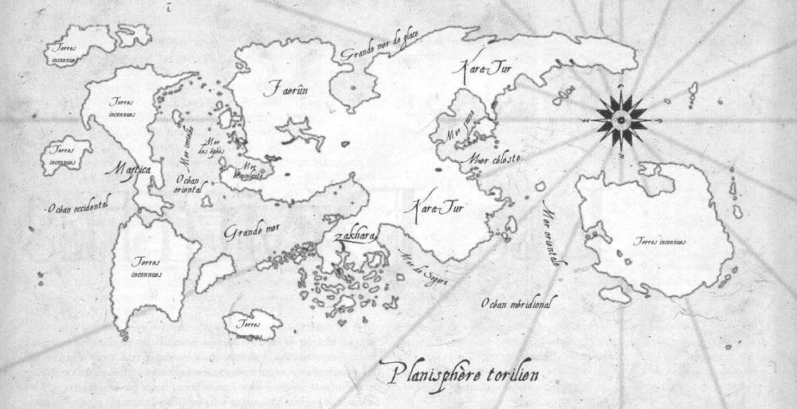

# Toril

# Continents

## [faerun](faerun/regions/regions.md)
- Faerûn ("Terre Unique" en elfique) est le principal continent de Toril. Il fait plus de 5600 km d'est en ouest et plus de 4000 du nord au sud.