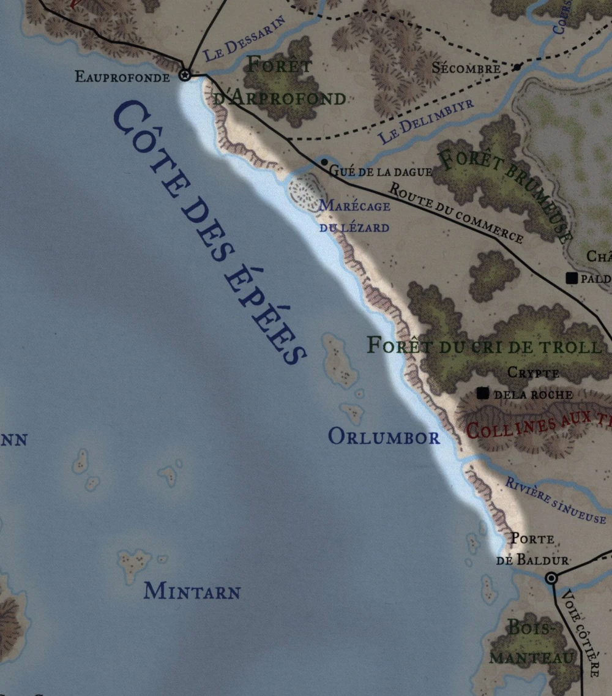

# La côte des épées

## Géographie

Située à l'extrême ouest des Contrées du Mitan occidentales, la Côte des Épées s'étend au nord, depuis l'embouchure du Fleuve Dessarin au sud d'Eauprofonde, vers le sud jusqu'à l'embouchure de la Rivière Chionthar et la Porte de Baldur. La côte située au nord d'Eauprofonde a le nom de Côte des Épées septentrionale. Au large s'étend la Mer des Épées.

# Village

- [Phandaline](cites/phandaline.md)

# Lieux

- [Gnomengarde](lieux/gnomengarde.md)

