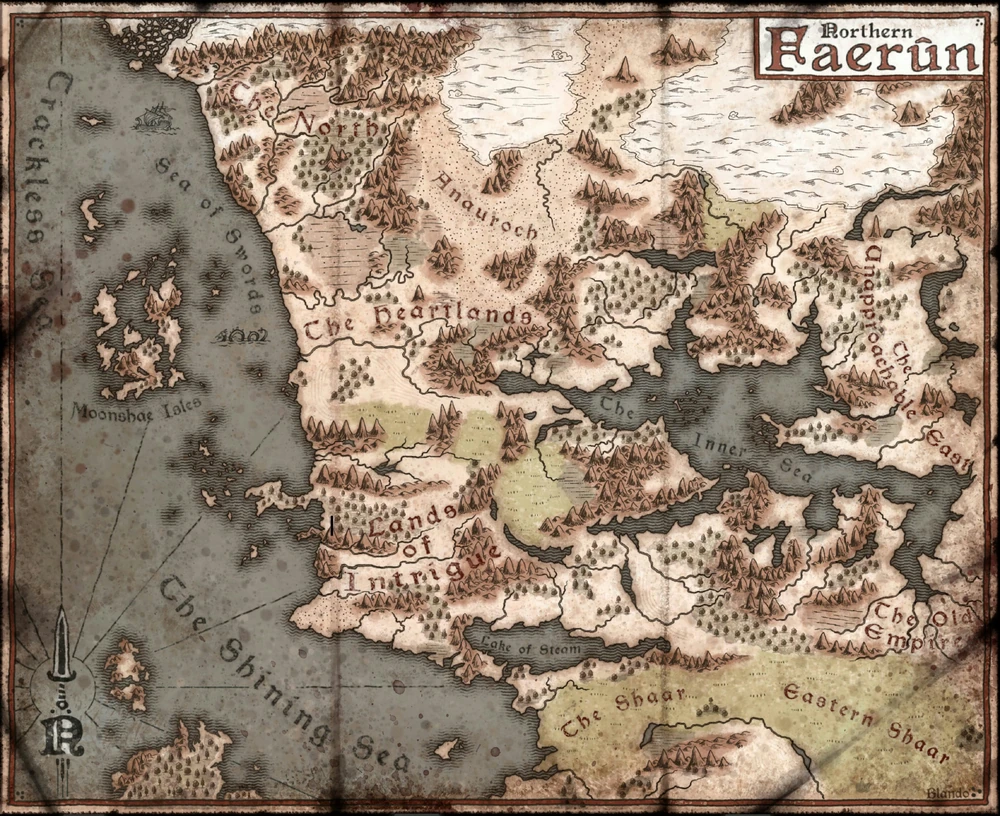

# Faerun

## Géographie

Ce continent est une terre encore plus riche et variée que n'importe quelle autre. Outre le littoral à l'ouest et au sud qui lui sert de limite, la caractéristique la plus significative de ce continent est sans nul doute la Mer des Étoiles déchues. C'est une mer intérieure qui entretient la fertilité des terres alentours et sert de route commerciale majeure pour de nombreuses nations limitrophes.

Vient ensuite le Shaar, une vaste région de prairies située plus au sud qui, avec le Lac de vapeur, sépare les territoires de la mer intérieure des nations côtières de l'extrémité sud du continent. À l'est, Faerûn est bordée par de vastes steppes s'étendant jusqu'à Kara-Tur, et au nord par d'immenses glaciers (Pelvuria et Reghed) et de la toundra. Au sud du continent, séparé par la Grande Mer , se trouve le territoire sub-tropical de Zakhara.

## Régions 

[La côtes des épées](cotedesepees/cotedesepees.md)

- La Côte des Épées est une côte rocheuse qui tire son nom des falaises blanches et tranchantes, les Dents de l'Épée. Celles-ci s'élèvent le long du rivage, séparant la mer à l'ouest, et la terre à l'est. Les falaises peuvent atteindre près de huit cents mètres de haut. Il n'y a presque aucun point d'ancrage praticable pour les navires le long de cette côte et les ports y sont rares et épars.