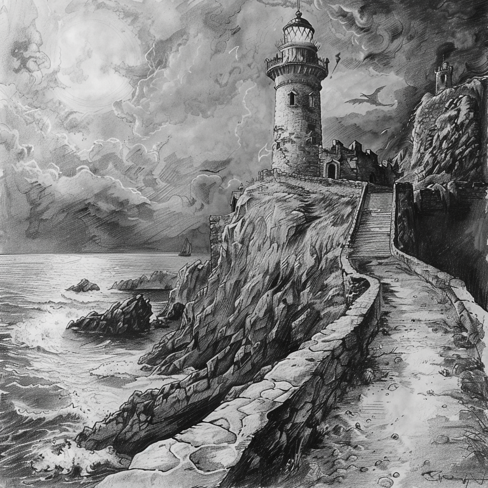
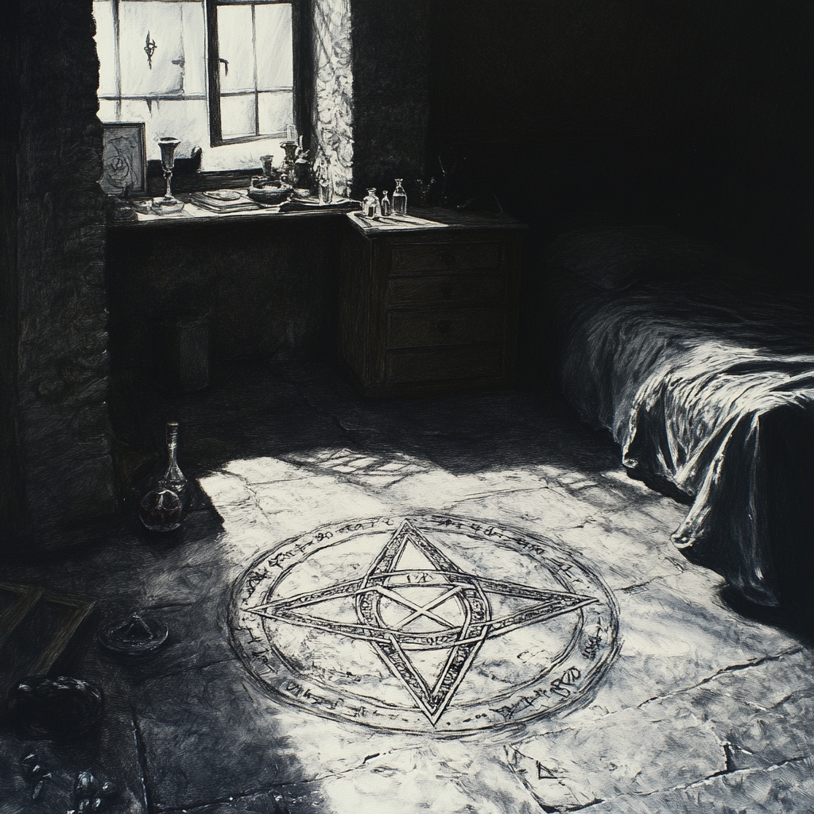

# Campagne de la flèche de givre

## Personnages

[Astal](../../personnages/Astal.md)

[Nemeïa](../../personnages/nemeia.md)

[Francis Lalanus](../../personnages/francis_lalanus.md)

[Stor souffletempête](../../personnages/francis_lalanus.md)

## PNJ

[Toblen Rocheline](../../pnj/toblen_rocheline.md)

## Chronologie

l'an 1000 du calendrier du Val

## Introduction  

L’aventure débute dans un fracas de terreur et de glace : un jeune dragon blanc fond sur un convoi de voyageurs en route vers [phandaline](../../../atlas/faerun/regions/cotedesepees/cites/phandaline.md). Dans la panique, trente âmes trouvent balayées par les griffes et le souffle glacé de la créature. Seuls trois survivants émergent de ce carnage : [nemeia](../../personnages/nemeia.md),[Astal](../../personnages/Astal.md) et [Francis Lalanus](../../personnages/francis_lalanus.md), chacun portant en lui la douleur et la rage de cette attaque. Bouleversés, mais vivants, ils trouvent refuge à Phandaline, où ils pansent leurs blessures et, entre deux silences lourds de deuil, se jurent de traquer et de défaire le dragon qui tourmente la région depuis des semaines.

Leur soif de vengeance les guide dans les recoins les plus dangereux de la Côte des Épées, jusqu’à leur rencontre avec [storm](../../personnages/storm.md), un magicien énigmatique dont les talents se révèlent indispensables. Ensemble, ils pénètrent dans les profondeurs de la grotte de [gnomengarde](../../../atlas/faerun/regions/cotedesepees/lieux/gnomengarde.md), un lieu réputé pour ses pièges et ses mystères. Là, ils affrontent et terrassent le mimic qui hante les lieux, une créature polymorphe ayant semé la terreur parmi les gnomes. En guise de récompense pour leur courage, les deux rois de Gnomengarde leur offrent des trésors inestimables, consolidant encore davantage les liens qui unissent les compagnons.

Mais le retour vers Phandaline n’est pas l’occasion du repos escompté. Francis, au regard acéré, aperçoit des volutes de fumée s’élevant du village, un signe inquiétant que quelque chose de funeste s’y déroule. Il avertit ses compagnons de se tenir prêts à tout. À leur arrivée, une vision de cauchemar se déploie devant eux : une troupe de guerre orque dévaste le village, laissant dans son sillage des bâtisses incendiées et des habitants terrorisés. Les aventuriers se jettent dans la mêlée, abattant quatre orcs d’un combat acharné avant d’affronter l’Orog, chef brutal et impitoyable de cette horde. Dans un coup final d’une précision implacable, Francis plante l’une de ses lames dans la gorge de l’Orog, et les orcs, étrangement, battent soudain en retraite, laissant derrière eux un village en ruines.

Dans l’accalmie qui suit, le groupe fouille les corps des orcs et fouille les ruines pour secourir les villageois, trouvant parmi eux [Toblen Rocheline](../../pnj/toblen_rocheline.md), l’aubergiste, gravement blessé mais vivant. Les aventuriers le soignent, et le village se rassemble à l’auberge, l’un des rares bâtiments ayant échappé aux flammes. La nuit venue, le silence et les braises marquent ce moment de répit.

À l’aube, Toblen, déjà debout, mène avec détermination les villageois dans une première tentative de reconstruction et de fortification rudimentaire, décidé à rendre Phandaline plus résilient face à de futures attaques. Il demande alors une faveur aux aventuriers : récupérer un trésor que des mercenaires, aujourd’hui tombés au combat, cherchaient également. Ce trésor pourrait être la clé du renouveau de Phandaline. En échange de leurs services, Toblen leur propose quatre lopins de terre, suffisamment vastes pour y bâtir chacun une maison.

Acceptant cette dernière mission, les aventuriers mettent en œuvre toute leur expertise pour localiser le trésor et se mettent en marche. Après une journée d’exploration, alors que le soleil est au zénith, Francis, le plus observateur du groupe, aperçoit au loin un phare fortifié, imposant et mystérieux. Leur quête vient de prendre un nouveau tournant, et chaque pas les rapproche d’un avenir où justice et espoir renaîtront pour Phandaline.

des harpies ont étés tué au phares, moesko a été vaincu dans sa pièce, les aventuriers ont dormis dans une pièce 

Les aventuriers avancent dans les rues de Phandaline, le sac en toile qu’ils tiennent ensemble débordant de pièces d’or et de pierres précieuses – un trésor amassé dans le phare hanté par Moesko. Leur visage est marqué par la fatigue, mais leurs yeux brillent d’un éclat de victoire, et chaque pas attire l’attention des villageois. Les chuchotements se répandent rapidement, et bientôt une petite foule de villageois les suit, les yeux rivés sur le sac de toile, rempli d’espoirs pour la reconstruction de leur village.

Au centre du village, Toblen Rochecolline, le maire au regard attentif et aux épaules solides, les attend, accompagné de quelques artisans et paysans qui observent la scène avec une lueur d’espoir. Les villageois se rassemblent en silence alors que les aventuriers s'approchent du maire, déposant devant lui le lourd sac rempli de pièces et de gemmes, qui émettent un scintillement sous la lumière douce de l’après-midi.

Toblen fixe le sac d’un regard ému, presque incrédule, avant de lever les yeux vers les aventuriers. Sa voix, grave mais pleine de reconnaissance, résonne dans le silence respectueux :

« Braves gens de Phandaline ! Ces aventuriers ont affronté des dangers que beaucoup n’oseraient imaginer, et ils ont ramené avec eux les moyens de rebâtir notre village. Grâce à eux, nous avons maintenant les ressources nécessaires pour redonner vie à Phandaline ! »

Un murmure de joie traverse la foule, et quelques personnes essuient discrètement des larmes de soulagement. Toblen prend délicatement une poignée de pièces d'or entre ses doigts calleux, puis les laisse tomber en pluie dans le sac avec un sourire. « Cet or, c’est le symbole de notre avenir. Ces pierres précieuses sont les fondations d'un nouveau départ. »

Les villageois applaudissent, et rapidement, certains se rapprochent pour exprimer leur gratitude directement aux aventuriers : des artisans serrent leurs mains, des paysans leur offrent de petits cadeaux, comme des pommes et du pain frais, et des enfants les regardent avec des yeux écarquillés, rêvant de leurs propres futures aventures.

Les villageois, sous la direction de Toblen, commencent alors à distribuer les richesses avec soin. Une partie servira à acheter du bois et de la pierre pour reconstruire les maisons les plus touchées, une autre ira à des outils et fournitures pour les fermiers et artisans, tandis qu’un modeste surplus sera gardé pour des protections rudimentaires en cas de futures attaques.

La scène se termine dans une atmosphère d'espoir et de renouveau, et même si les aventuriers n’avaient qu’un sac pour transporter les trésors du phare hanté, ils réalisent que leur exploit a transformé plus que les coffres du village : ils ont ramené à Phandaline un souffle de courage et d’unité.

Parrallèlement à cette histoire , Stor expérimentait sa magie dans sa chambre d'auberge quand soudainnement, il disparu dans un bruit de tonnerre , révéillant ses voisins de chambres Elehayym [Elehayym](../../personnages/Elehayym.md) et [Aleksander](../../personnages/Aleksander.md)
Aleksander

Au centre de la chambre d'auberge de Stor, dessiné avec une précision inquiétante, se trouve un pentacle complexe. Le symbole, tracé en une poudre grisâtre qui semble scintiller faiblement, occupe une large portion du sol, et chaque ligne est finement courbée, comme si elle avait été gravée par une main expérimentée.

