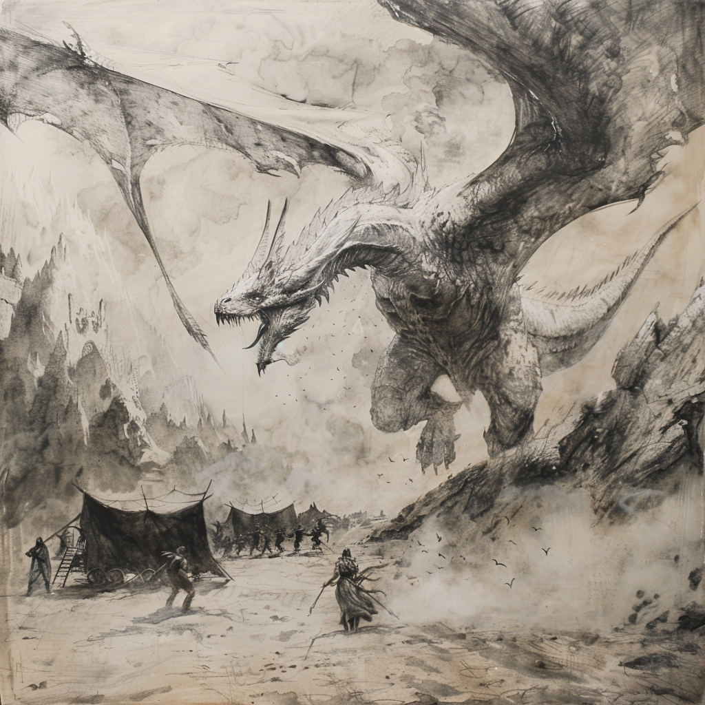
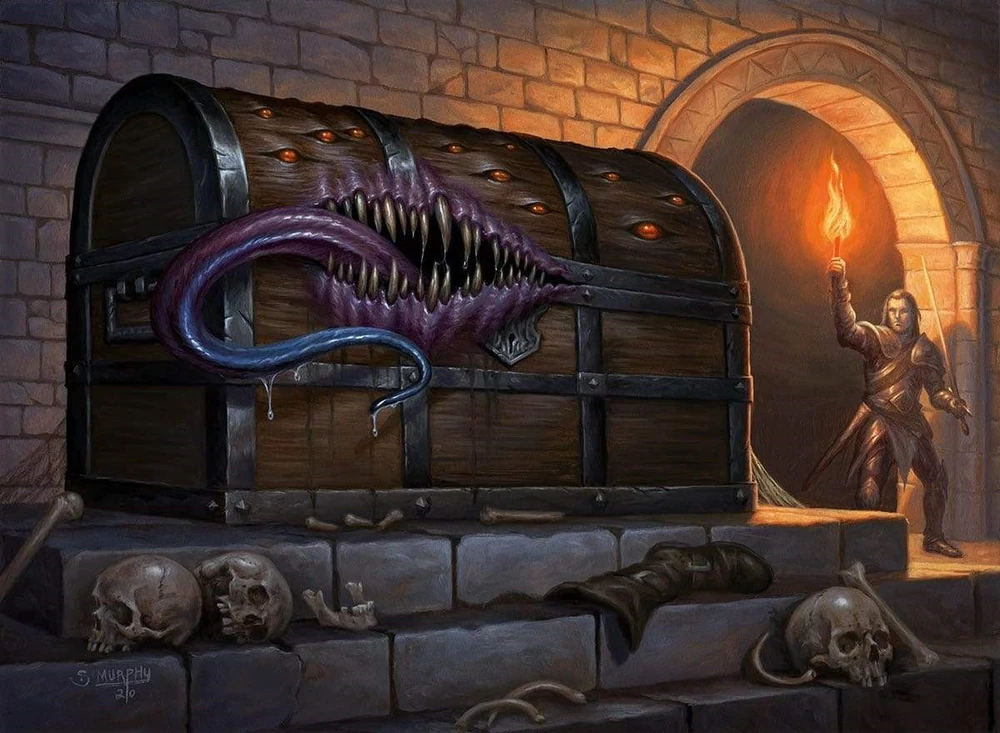
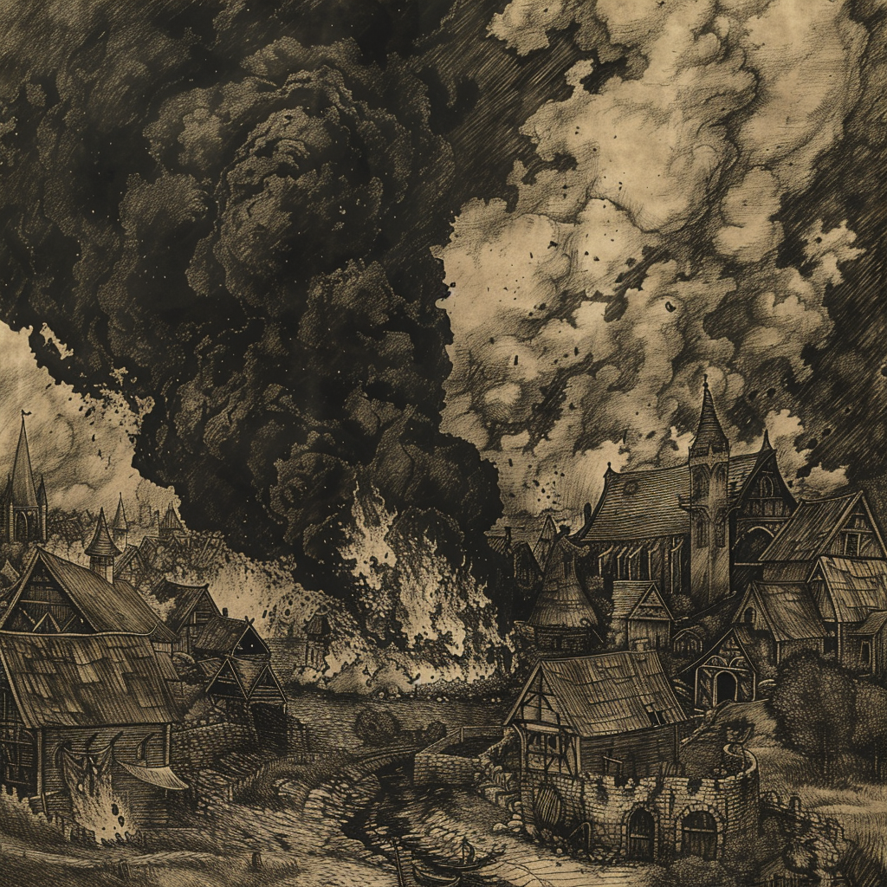

# Campagne de la flèche de givre

## Personnages

[nemeia](../../personnages/nemeia.md)

[alix](../../personnages/alix.md)

[nugar](../../personnages/nugar.md)

[storm](../../personnages/storm.md)

## PNJ

[Toblen Rocheline](../../pnj/toblen_rocheline.md)

## Chronologie

l'an 1000 du calendrier du Val

## Introduction  

L'aventure commence lors de l'attaque d'un convoi de voyageur en direction du village de [phandaline](../../../atlas/faerun/regions/cotedesepees/cites/phandaline.md) par un jeune dragon blanc

le convoit regroupait une trentaines d'individus aux profils et aux rêves tous plus diffèrent les uns des autres

De ce convoit, seules [nemeia](../../personnages/nemeia.md),[alix](../../personnages/alix.md) et [nugar](../../personnages/nugar.md) en ressortèrent vivant ils passèrent quelques temps au village afin de se remettre de leurs émotions et se firent la promesse de se venger ensemble du dragon qui tourmente la région depuis maintenant plusieurs semaines

Au fil de leurs aventures, ils rencontrèrent le magicien [storm](../../personnages/storm.md) , s'allièrent avec lui afin d'explorer ensemble la grotte de [gnomengarde](../../../atlas/faerun/regions/cotedesepees/lieux/gnomengarde.md)

Suite à leur victoire contre le mimic qui hantait cette grotte , le groupe d'aventurier fut récompensé par les deux rois de [gnomengarde](../../../atlas/faerun/regions/cotedesepees/lieux/gnomengarde.md) et se décidèrent de retourner à [phandaline](../../../atlas/faerun/regions/cotedesepees/cites/phandaline.md)

Lors de leur voyage retour vers le village de phandaline,[nugar](../../personnages/nugar.md) aperçut des nuages de fumée venant de celui ci , il conseilla à ses compagnons d'armes de se tenir prêt au combat

Lors de leur arrivé, le village était envahit par une troupe de guerre Orc, nos aventuriers ont vaillament affronté 4 orc avant de triompher d'un orc Orog qui avait laissé le tavernier [Toblen Rocheline](../../pnj/toblen_rocheline.md) pour mort

Lorsque [nugar](../../personnages/nugar.md) enfonça l'une de ses lames dans la gorge de l'orog, la troupe de guerre batti en retraite pour une raison encore inconnue

le groupe d'aventurier décida de fouiller les orcs et de chercher des survivants dans l'auberge de rochecolline, l'un des rares batiments encore debout.
Ils décidèrent également de soigner l'aubergiste et de dormir cette nuit dans cette même auberge

Le lendemain matin, [Toblen Rocheline](../../pnj/toblen_rocheline.md) déjà debout avait réunit les villageois et entreprit la reconstruction du village ainsi que sa fortification sommaire afin d'éviter une nouvelle attaque

[Toblen Rocheline](../../pnj/toblen_rocheline.md) demanda une ultime faveur à notre groupe d'aventurier afin de récuperer un trésor qui était recherché par un groupe de mercenaire mort pendant l'attaque
Grâce à l'argent de celui ci, le village aurait une chance de se remettre de l'attaque

Nos aventuriers acceptèrent en échange de 4 lopins de terre suffisant pour y construire chacun une maison
