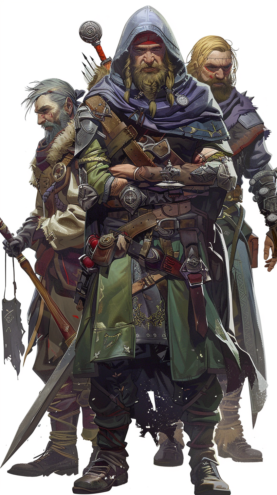

# Darius Martel / Haldric Martel / Theron Martel

## Mercenaires

## Naissance : 960 / 958 /  970 du calendrier de Val

## Biographie

Haldric, le plus âgé, était le chef incontesté du trio. Charismatique et impitoyable, il avait la capacité de transformer chaque situation à son avantage. Son épée rapide et ses compétences en tactique lui avaient valu le respect de ses frères et de ses hommes.

Darius, le second, était un archer de talent. Ses flèches étaient aussi précises que sa langue était acérée. Il avait un sens aigu des opportunités et savait comment utiliser son arc pour abattre ses ennemis sans pitié. Sa réputation de tireur d'élite était légendaire parmi les bandits.

Theron, le plus jeune, était un mage habile. Il avait étudié les arts sombres de la magie dans les secrets de l'ombre, utilisant ses sorts pour semer la confusion et la destruction parmi ceux qui osaient s'opposer à eux. Sa maîtrise des éléments rendait les assauts des frères encore plus redoutables.

 

Fiche personnage Haldric

### Haldric Martel

*Humain Guerrier (Chef de Bandits)*

**Classe d'Armure** 16 (armure de cuir, bouclier)

**Points de Vie** 45 (6d10 + 12)

**Vitesse** 30 pieds

| Caractéristique | Score | Modificateur |
|-----------------|-------|--------------|
| Force           | 16 (+3) |  |
| Dextérité       | 14 (+2) |  |
| Constitution    | 14 (+2) |  |
| Intelligence    | 10 (+0) |  |
| Sagesse         | 12 (+1) |  |
| Charisme        | 14 (+2) |  |

**Jets de sauvegarde** Force +5, Constitution +4

**Compétences** Athlétisme +5, Intimidation +4

**Sens** Perception passive 11

**Langues** Commun

**Niveau de difficulté** 3 (700 PX)

---

**Traits**

**Action Secondaire.** Haldric peut utiliser une action secondaire pour permettre à un allié à portée de 30 pieds de faire une attaque d'arme ou de lancer un sort mineur.

**Commandement de Chef.** Les alliés à portée de 30 pieds de Haldric ont un avantage sur les jets d'attaque lors de leur prochain tour.

---

**Actions**

**Épée Longue.** Attaque d'arme de mêlée : +5 pour toucher, allonge 5 pieds, une cible. *Touché :* 8 (1d8 + 3) dégâts tranchants.

**Arc Court.** Attaque d'arme à distance : +4 pour toucher, portée 80/320 pieds, une cible. *Touché :* 6 (1d6 + 2) dégâts perforants.

Fiche personnage Darius

### Darius Martel

*Humain Archer (Bandit Expert en Discrétion)*

**Classe d'Armure** 14 (armure de cuir)

**Points de Vie** 36 (7d8 + 7)

**Vitesse** 30 pieds

| Caractéristique | Score | Modificateur |
|-----------------|-------|--------------|
| Force           | 12 (+1) |  |
| Dextérité       | 16 (+3) |  |
| Constitution    | 12 (+1) |  |
| Intelligence    | 10 (+0) |  |
| Sagesse         | 14 (+2) |  |
| Charisme        | 10 (+0) |  |

**Jets de sauvegarde** Dextérité +5

**Compétences** Discrétion +7, Perception +4

**Sens** Perception passive 14

**Langues** Commun

**Niveau de difficulté** 2 (450 PX)

---

**Traits**

**Tireur d'Élite.** Darius peut ajouter son bonus de Dextérité aux dégâts qu'il inflige avec son arc court.

**Mouvement Furtif.** Darius peut se déplacer furtivement jusqu'à la moitié de sa vitesse sans se faire remarquer.

---

**Actions**

**Arc Court.** Attaque d'arme à distance : +5 pour toucher, portée 80/320 pieds, une cible. *Touché :* 7 (1d6 + 3) dégâts perforants.

Fiche personnage Theron

### Theron Martel

*Humain Mage de Guerre (Bandit Utilisant la Magie)*

**Classe d'Armure** 12

**Points de Vie** 30 (4d8 + 8)

**Vitesse** 30 pieds

| Caractéristique | Score | Modificateur |
|-----------------|-------|--------------|
| Force           | 10 (+0) |  |
| Dextérité       | 12 (+1) |  |
| Constitution    | 14 (+2) |  |
| Intelligence    | 16 (+3) |  |
| Sagesse         | 12 (+1) |  |
| Charisme        | 10 (+0) |  |

**Jets de sauvegarde** Intelligence +5, Constitution +4

**Compétences** Arcanes +5, Tromperie +2

**Sens** Perception passive 11

**Langues** Commun

**Niveau de difficulté** 2 (450 PX)

---

**Sorts Connus** (niveau 4, DC de sauvegarde de sort 13, +5 pour toucher avec des attaques de sort)

**Sorts de Magie de Guerre** : 2 sorts

**Traits**

**Sorts de Magie de Guerre.** Theron peut lancer un sort et utiliser son action pour effectuer une attaque avec une arme légère en tant qu'action bonus.

**Mémoire Élargie.** Theron peut lancer une fois par jour un sort qu'il ne prépare pas.

