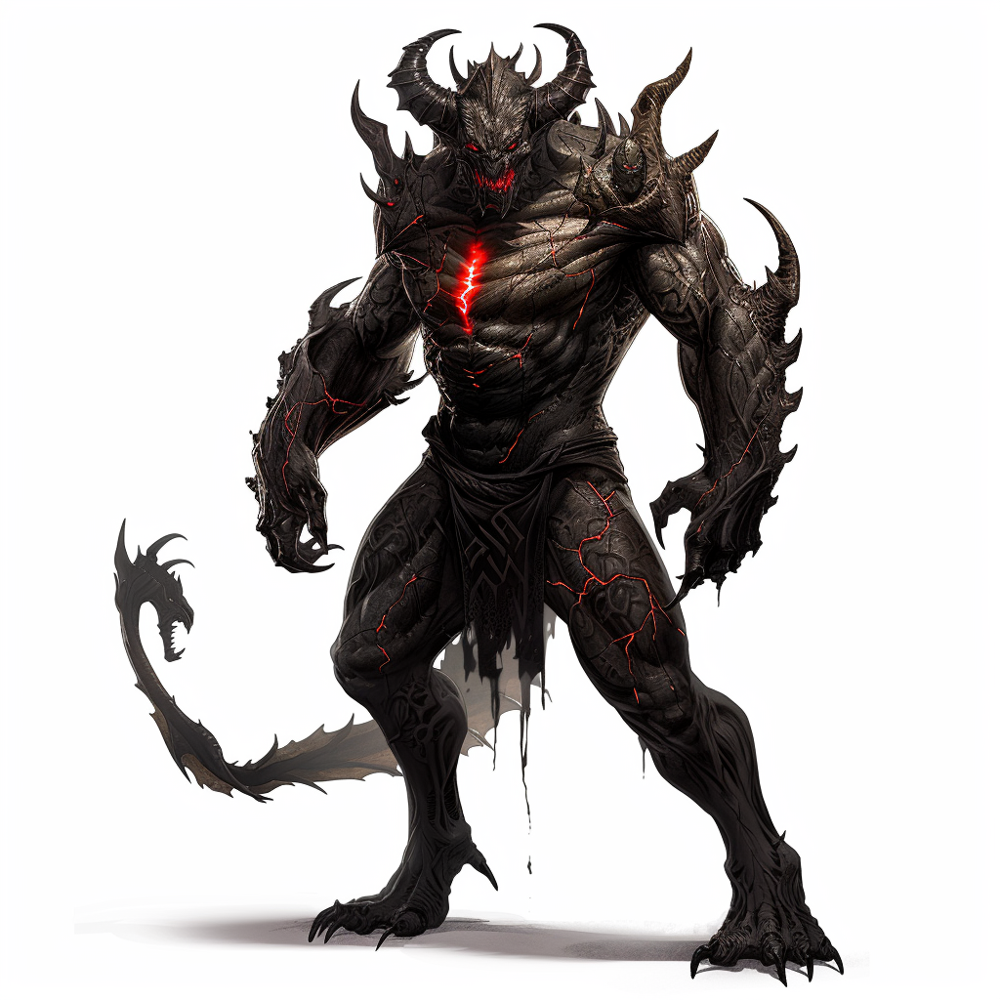
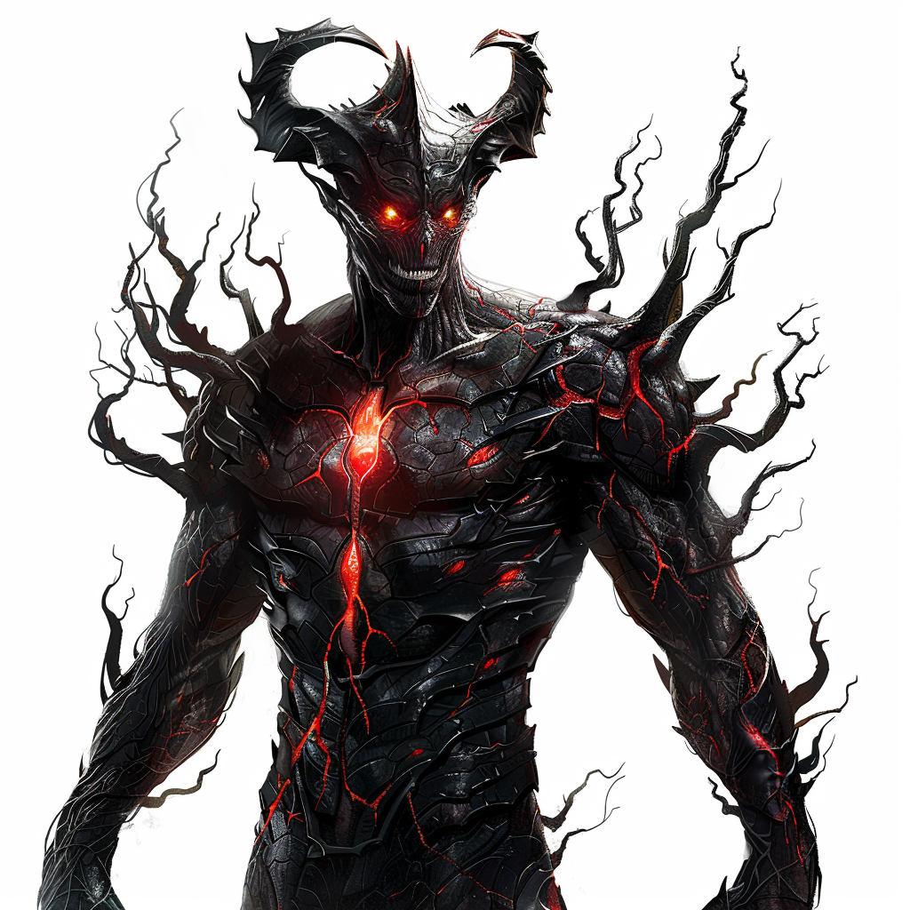

Background

Kartharoth est une créature colossale mesurant environ 3 mètres de haut, avec une musculature massive et des proportions à la fois humanoïdes et bestiales. Sa peau est noire comme la nuit, marquée de veines rougeoyantes, et son visage terrifiant arbore des yeux rouges luisants et une bouche garnie de crocs acérés. De larges cornes tordues émergent de son front.

Ses mains énormes se terminent par des griffes tranchantes, et son torse est couvert d'écailles sombres gravées de runes lumineuses. Une queue épaisse et pointue ajoute à son arsenal d'armes naturelles. L'aura de Kartharoth est oppressante, imprégnée de terreur et de malveillance, rendant même les plus courageux tremblants de peur.

## Biographie 

### Origine de Kartharoth

Kartharoth est une créature née de la colère et du chaos, une entité redoutable dont l'origine est liée aux dieux sombres et aux forces chaotiques du multivers de Donjons et Dragons.

#### Création par Bhaal, le Seigneur du Meurtre

Dans les temps anciens, avant même que les royaumes ne prennent forme, Bhaal, le dieu du meurtre, cherchait à créer une arme vivante pour semer la terreur et la destruction à travers le monde. Utilisant les énergies chaotiques du plan des Abysses, Bhaal concentra sa rage et sa malveillance dans une seule créature, donnant naissance à Kartharoth.

#### Les Influences de Talos et Bane

Kartharoth ne fut pas seulement influencé par Bhaal. Talos, le dieu des tempêtes et de la destruction, et Bane, le dieu de la tyrannie, ajoutèrent leur pouvoir à cette création. Talos insuffla à Kartharoth la force des tempêtes, rendant sa rage aussi incontrôlable et dévastatrice qu'un ouragan. Bane, quant à lui, apporta une volonté de domination et de cruauté, façonnant l'esprit de la créature pour en faire un conquérant impitoyable.

#### La Chute et l'Emprisonnement

Les dieux, voyant le potentiel destructeur de Kartharoth, décidèrent de l'utiliser pour semer le chaos parmi leurs ennemis. Cependant, la créature devint incontrôlable, menaçant l'équilibre même des plans. Myrkul, le dieu des morts, fut chargé de capturer Kartharoth. Utilisant ses pouvoirs nécromantiques, Myrkul parvint à piéger l'essence de la créature dans un artefact : le cristal de ****

Forme pleine

# Kartharoth

**Taille :** Gigantesque (3 mètres de haut)  
**Type :** Fiélon  
**Alignement :** Chaotique Mauvais

## Caractéristiques

- **Classe d'Armure :** 18 (armure naturelle)
- **Points de Vie :** 300 (20d12 + 160)
- **Vitesse :** 40 pieds

| Caractéristique | Valeur |
|-----------------|--------|
| Force           | 26 (+8)|
| Dextérité       | 14 (+2)|
| Constitution    | 26 (+8)|
| Intelligence    | 12 (+1)|
| Sagesse         | 16 (+3)|
| Charisme        | 18 (+4)|

## Jets de Sauvegarde

- **Force :** +14
- **Constitution :** +14
- **Sagesse :** +9
- **Charisme :** +10

## Compétences

- **Intimidation :** +10
- **Perception :** +9

## Résistances aux Dégâts

- Acide, Froid, Feu, Foudre

## Immunités aux Dégâts

- Poison ; dégâts contondants, perforants et tranchants provenant d'attaques non magiques

## Immunités aux États

- Charmé, Effrayé, Empoisonné

## Sens

- Vision dans le noir 120 pieds, Perception passive 19

## Langues

- Abyssal, Commun, Infernal, Télépathie 120 pieds

## Niveau de Défi

- 20 (25,000 PX)

## Traits

### Résistance Magique

Kartharoth a l'avantage aux jets de sauvegarde contre les sorts et autres effets magiques.

### Régénération

Kartharoth regagne 20 points de vie au début de son tour. S'il subit des dégâts radieux, cette capacité ne fonctionne pas jusqu'au début de son prochain tour.

### Aura de Terreur

Toute créature hostile qui commence son tour à moins de 30 pieds de Kartharoth doit réussir un jet de sauvegarde de Sagesse DD 18 ou être effrayée jusqu'à la fin de son prochain tour. Si le jet de sauvegarde est réussi, la créature est immunisée contre l'Aura de Terreur de Kartharoth pour les 24 prochaines heures.

## Actions

### Multiattaques

Kartharoth peut effectuer trois attaques : une avec sa morsure et deux avec ses griffes.

### Morsure

- **Attaque au corps à corps avec arme :** +14 pour toucher, allonge 10 pieds, une cible. 
- **Touché :** 21 (3d8 + 8) dégâts perforants.

### Griffes

- **Attaque au corps à corps avec arme :** +14 pour toucher, allonge 10 pieds, une cible.
- **Touché :** 17 (2d8 + 8) dégâts tranchants.

### Souffle Chaotique (Recharge 5-6)

Kartharoth exhale une onde de chaos dans un cône de 60 pieds. Chaque créature dans cette zone doit effectuer un jet de sauvegarde de Dextérité DD 20, subissant 56 (16d6) dégâts de force en cas d'échec, ou la moitié en cas de réussite.

## Réactions

### Riposte Féroce

Lorsqu'il est touché par une attaque au corps à corps, Kartharoth peut utiliser sa réaction pour effectuer une attaque de griffes contre l'attaquant.

Forme inférieur

# Kartharoth (Adapté pour Niveau 5)

**Taille :** Grand (3 mètres de haut)  
**Type :** Fiélon  
**Alignement :** Chaotique Mauvais

## Caractéristiques

- **Classe d'Armure :** 15 (armure naturelle)
- **Points de Vie :** 136 (16d10 + 48)
- **Vitesse :** 30 pieds

| Caractéristique | Valeur |
|-----------------|--------|
| Force           | 18 (+4)|
| Dextérité       | 12 (+1)|
| Constitution    | 16 (+3)|
| Intelligence    | 10 (+0)|
| Sagesse         | 14 (+2)|
| Charisme        | 16 (+3)|

## Jets de Sauvegarde

- **Force :** +7
- **Constitution :** +6
- **Sagesse :** +5
- **Charisme :** +6

## Compétences

- **Intimidation :** +6
- **Perception :** +5

## Résistances aux Dégâts

- Acide, Froid, Feu, Foudre

## Immunités aux Dégâts

- Poison

## Immunités aux États

- Charmé, Effrayé, Empoisonné

## Sens

- Vision dans le noir 120 pieds, Perception passive 15

## Langues

- Abyssal, Commun, Infernal

## Niveau de Défi

- 9 (5,000 PX)

## Traits

### Résistance Magique

Kartharoth a l'avantage aux jets de sauvegarde contre les sorts et autres effets magiques.

### Régénération

Kartharoth regagne 10 points de vie au début de son tour. S'il subit des dégâts radieux, cette capacité ne fonctionne pas jusqu'au début de son prochain tour.

## Actions

### Multiattaques

Kartharoth peut effectuer deux attaques : une avec sa morsure et une avec ses griffes.

### Morsure

- **Attaque au corps à corps avec arme :** +7 pour toucher, allonge 5 pieds, une cible. 
- **Touché :** 14 (2d10 + 4) dégâts perforants.

### Griffes

- **Attaque au corps à corps avec arme :** +7 pour toucher, allonge 5 pieds, une cible.
- **Touché :** 10 (2d6 + 4) dégâts tranchants.

### Souffle Chaotique (Recharge 5-6)

Kartharoth exhale une onde de chaos dans un cône de 30 pieds. Chaque créature dans cette zone doit effectuer un jet de sauvegarde de Dextérité DD 14, subissant 28 (8d6) dégâts de force en cas d'échec, ou la moitié en cas de réussite.

## Réactions

### Riposte Féroce

Lorsqu'il est touché par une attaque au corps à corps, Kartharoth peut utiliser sa réaction pour effectuer une attaque de griffes contre l'attaquant.

