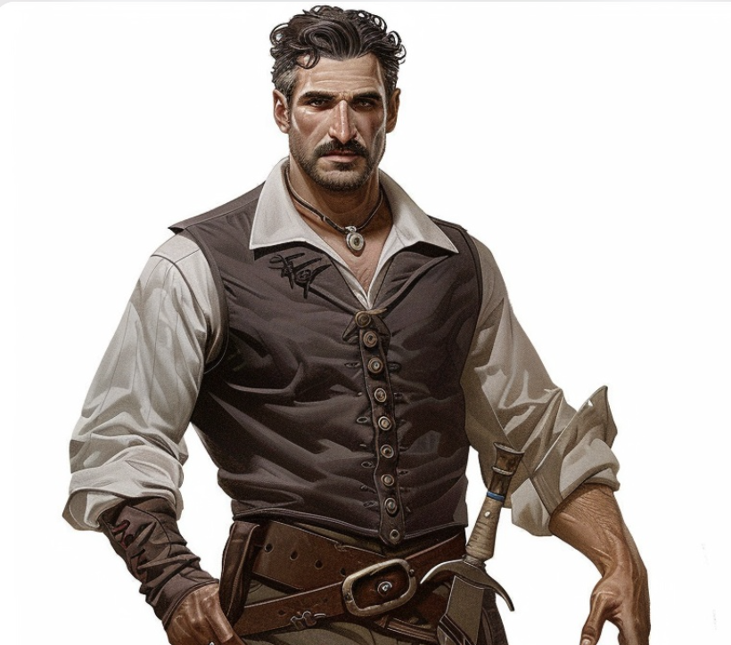

# Toblen Rocheline

## Maire de Phandaline / propriétaire de l'auberge de rocheline

## Naissance : 955 du calendrier de Val

### Biographie

Peu de chose sont connue du passé de Toblen, il fut longtemps le propriétaire de l'unique auberge de [Phandaline](../../atlas/faerun/regions/cotedesepees/cites/phandaline.md)

Il frôla la mort lors du saccage du village en l'an 1000 , il fut sauvé par un groupe d'aventurier.
Suite à ces évenements , Toblen pris la tête du village et entreprit la reconstruction de Phandaline